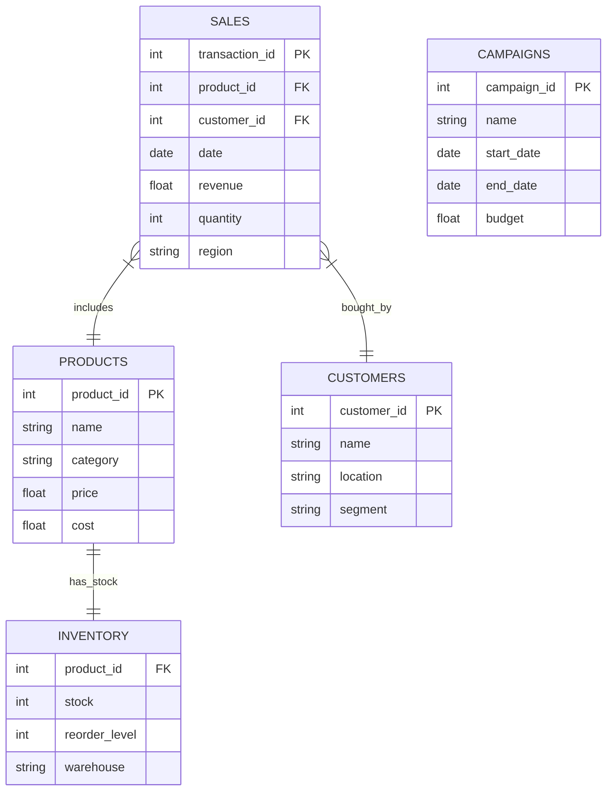

# 🗺️ Sales-Fusion Schema Diagram

```mermaid
erDiagram
    SALES {
        int transaction_id PK
        int product_id FK
        int customer_id FK
        date date
        float revenue
        int quantity
        string region
    }
    PRODUCTS {
        int product_id PK
        string name
        string category
        float price
        float cost
    }
    CUSTOMERS {
        int customer_id PK
        string name
        string location
        string segment
    }
    INVENTORY {
        int product_id FK
        int stock
        int reorder_level
        string warehouse
    }
    CAMPAIGNS {
        int campaign_id PK
        string name
        date start_date
        date end_date
        float budget
    }
    SALES }|--|| PRODUCTS : includes
    SALES }|--|| CUSTOMERS : bought_by
    PRODUCTS ||--|| INVENTORY : has_stock
```
